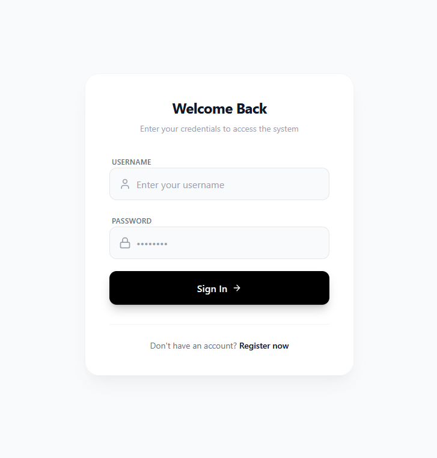
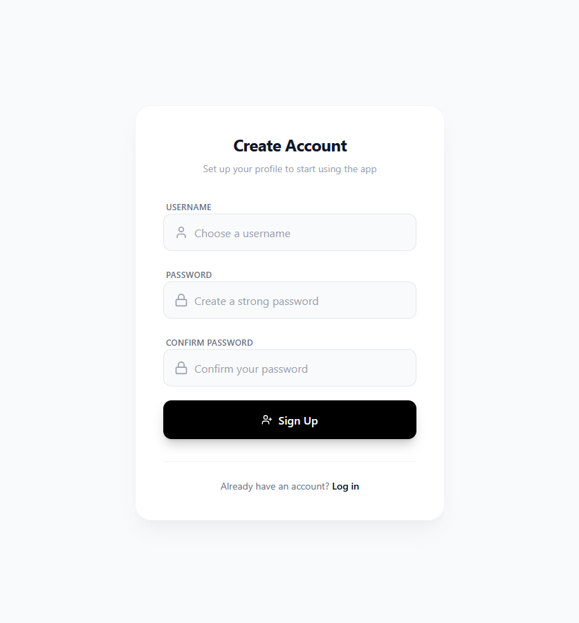
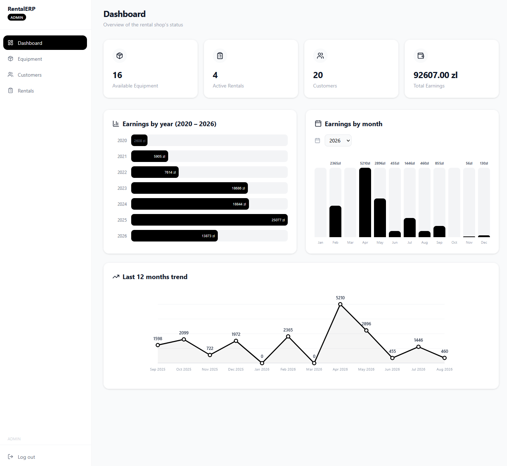
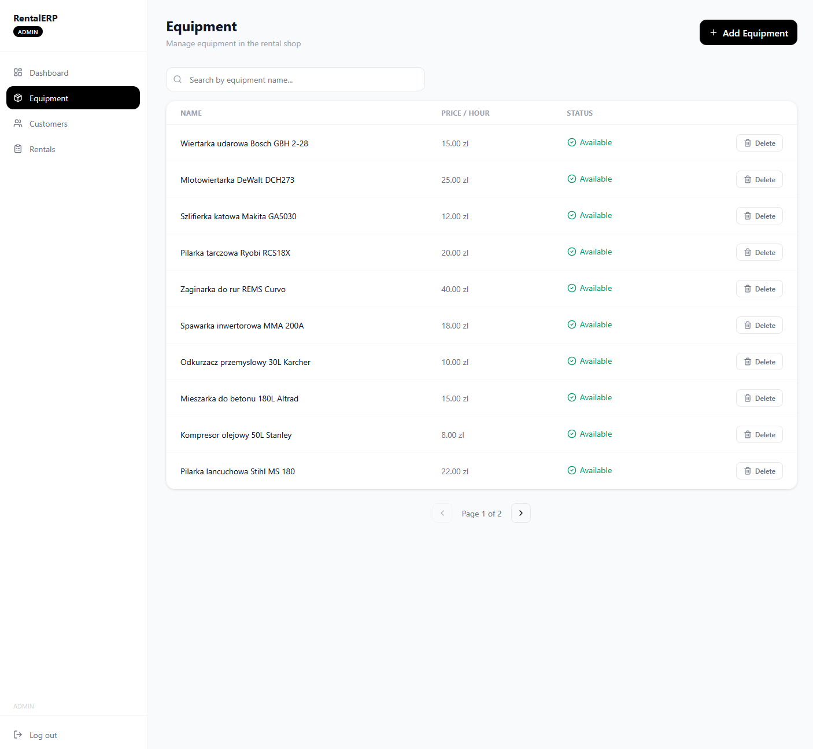
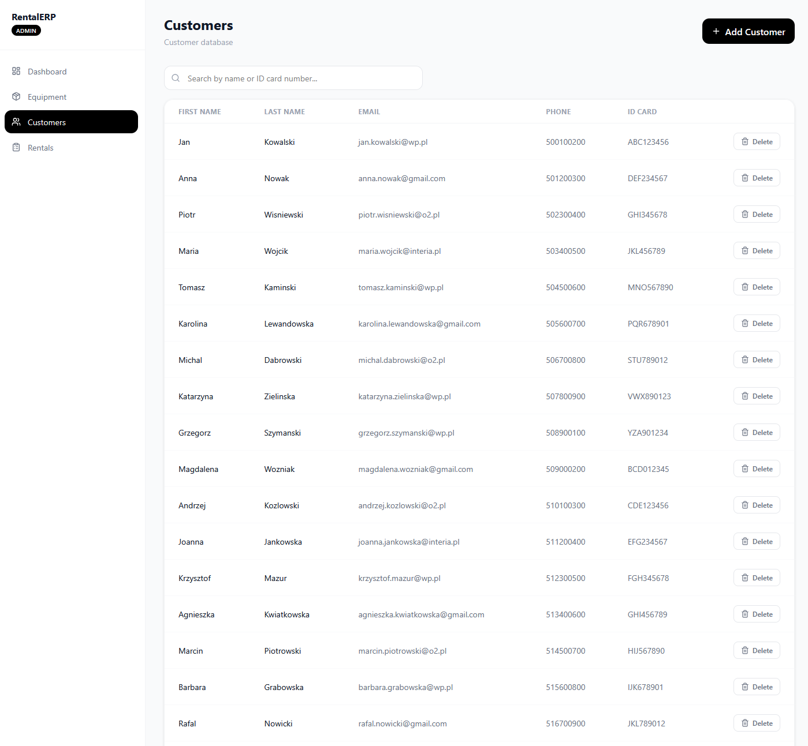
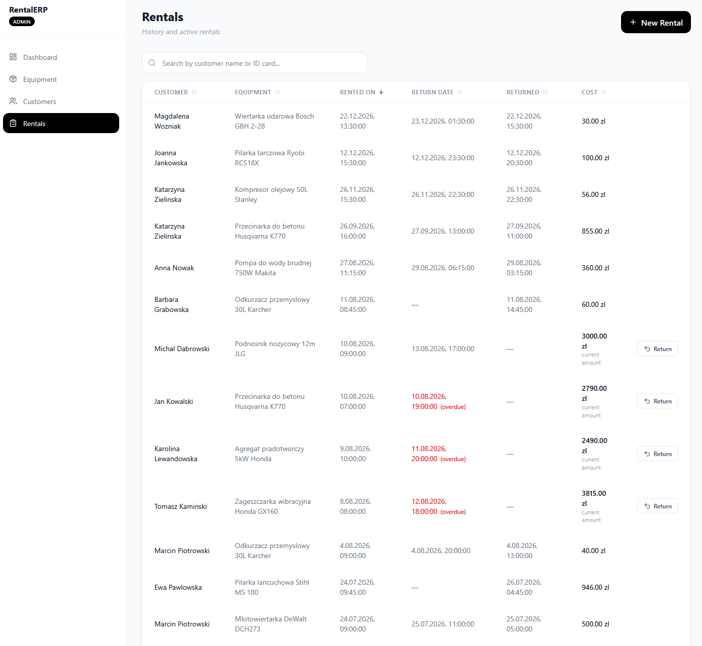

# Equipment Rental CRM/ERP

Aplikacja do zarządzania wypożyczalnią sprzętu - ewidencja sprzętu, klientów i wypożyczeń, z rozliczaniem kosztów w czasie rzeczywistym i panelem statystyk dla administratora.

Full-stack: **React + TypeScript** (frontend) i **Spring Boot** (backend REST API) z bazą **PostgreSQL**, uwierzytelnianiem **JWT** i kontrolą dostępu opartą o role.

---

## Stack technologiczny

| Warstwa          | Technologie                                                                            |
| ---------------- | -------------------------------------------------------------------------------------- |
| Frontend         | React, TypeScript, Vite, Tailwind CSS, React Router, Axios, lucide-react               |
| Backend          | Java 21, Spring Boot, Spring Security, Spring Data JPA, JWT, MapStruct, Lombok, Flyway |
| Baza danych      | PostgreSQL                                                                             |
| Infrastruktura   | Docker / Docker Compose, GitHub Actions (CI/CD), GitHub Container Registry             |
| Dokumentacja API | Swagger / OpenAPI                                                                      |

---

## Funkcjonalności

- **Rejestracja i logowanie** użytkowników, sesja oparta o token JWT (przechowywany w `sessionStorage`, dołączany automatycznie do requestów przez interceptor Axios)
- **Role użytkowników**: `ADMIN`, `EMPLOYEE`, `CUSTOMER` - różny zakres uprawnień w UI i na poziomie endpointów API (`@PreAuthorize`)
- **Zarządzanie sprzętem**: lista z paginacją i wyszukiwaniem (debounce 300 ms), dodawanie, „miękkie” usuwanie (sprzęt znika z list, ale historia wypożyczeń zostaje nienaruszona)
- **Zarządzanie klientami**: CRUD, wyszukiwanie po imieniu/nazwisku/numerze dokumentu, walidacja pól (m.in. unikalny e-mail i numer dokumentu)
- **Wypożyczenia**: tworzenie wypożyczenia (blokuje sprzęt jako niedostępny), rejestrowanie zwrotu, automatyczne wyliczanie kosztu na podstawie liczby godzin, oznaczanie przeterminowanych wypożyczeń, sortowanie i wyszukiwanie w tabeli, odświeżanie danych co 30 s
- **Dashboard**: kluczowe liczby (dostępny sprzęt, aktywne wypożyczenia, liczba klientów), a dla administratora dodatkowo wykresy przychodów: rocznie, miesięcznie (z wyborem roku) oraz trend z ostatnich 12 miesięcy

---

## Zrzuty ekranu

<div align="center">

  
  <br>
  <em>Ekran logowania</em>
  
  <br><br><br><br>

  
  <br>
  <em>Ekran rejestracji</em>
  
  <br><br><br><br>

  
  <br>
  <em>Dashboard administratora</em>
  
  <br><br><br><br>

  
  <br>
  <em>Lista sprzętu do wypożyczenia</em>
  
  <br><br><br><br>

  
  <br>
  <em>Lista klientów</em>
  
  <br><br><br><br>

  
  <br>
  <em>Lista wypożyczeń z aktywnym, naliczającym się kosztem</em>

</div>

---

## Architektura

**Backend** jest zbudowany w klasycznym, warstwowym stylu:

- `Controller` - przyjmuje żądania HTTP, deleguje logikę do serwisu, odpowiada za autoryzację (`@PreAuthorize("hasAnyRole(...)")`)
- `Service` - logika biznesowa (np. wyliczanie kosztu wypożyczenia, sprawdzanie dostępności sprzętu)
- `Repository` - dostęp do bazy przez Spring Data JPA
- `Mapper` (MapStruct) - konwersja DTO ↔ encja, żeby nie wystawiać encji bazodanowych bezpośrednio na zewnątrz
- `GlobalExceptionHandler` - jedno miejsce, w którym każdy typ błędu (404, walidacja, brak uprawnień, błąd biznesowy) zamieniany jest na spójną odpowiedź JSON

**Uwierzytelnianie**: przy logowaniu backend generuje token JWT z zaszytą rolą użytkownika. Każde kolejne żądanie przechodzi przez `JwtAuthenticationFilter`, który weryfikuje token i ustawia kontekst bezpieczeństwa Springa - dzięki temu endpointy mogą być zabezpieczone deklaratywnie, bez ręcznego sprawdzania w każdej metodzie.

**Wyliczanie kosztu wypożyczenia**: przy zwrocie sprzętu backend liczy liczbę pełnych godzin między startem a zwrotem (minimum 1 godzina, nawet jeśli wypożyczenie trwało kilka minut) i mnoży przez stawkę godzinową sprzętu. Dla aktywnych (jeszcze niezwróconych) wypożyczeń frontend liczy koszt „na żywo” tym samym algorytmem, żeby użytkownik widział aktualnie narastającą kwotę.

**„Miękkie” usuwanie**: zarówno sprzęt, jak i klienci mają pole `isDeleted`. Usunięcie z poziomu UI nie kasuje rekordu z bazy - ustawia flagę i element znika z list - dzięki temu historia wypożyczeń (która trzyma referencje do klienta i sprzętu) nigdy się nie rwie.

---

## Endpointy API

| Metoda | Endpoint                              | Dostęp          | Opis                                     |
| ------ | ------------------------------------- | --------------- | ---------------------------------------- |
| POST   | `/api/auth/register`                  | publiczny       | rejestracja nowego użytkownika           |
| POST   | `/api/auth/login`                     | publiczny       | logowanie, zwraca token JWT              |
| GET    | `/api/equipment`                      | publiczny       | lista sprzętu (paginacja + wyszukiwanie) |
| GET    | `/api/equipment/available`            | publiczny       | tylko dostępny sprzęt                    |
| GET    | `/api/equipment/{id}`                 | publiczny       | szczegóły sprzętu                        |
| POST   | `/api/equipment`                      | ADMIN, EMPLOYEE | dodanie sprzętu                          |
| DELETE | `/api/equipment/{id}`                 | ADMIN, EMPLOYEE | „miękkie” usunięcie sprzętu              |
| GET    | `/api/customers`                      | ADMIN, EMPLOYEE | lista klientów                           |
| GET    | `/api/customers/{id}`                 | ADMIN, EMPLOYEE | szczegóły klienta                        |
| POST   | `/api/customers`                      | ADMIN, EMPLOYEE | dodanie klienta                          |
| DELETE | `/api/customers/{id}`                 | ADMIN, EMPLOYEE | „miękkie” usunięcie klienta              |
| GET    | `/api/rental`                         | ADMIN, EMPLOYEE | lista wszystkich wypożyczeń              |
| POST   | `/api/rental`                         | ADMIN, EMPLOYEE | utworzenie wypożyczenia                  |
| POST   | `/api/rental/{id}/return`             | ADMIN, EMPLOYEE | rejestracja zwrotu i wyliczenie kosztu   |
| GET    | `/api/rental/customer/{customerId}`   | ADMIN, EMPLOYEE | historia wypożyczeń klienta              |
| GET    | `/api/rental/earnings`                | ADMIN           | suma wszystkich przychodów               |
| GET    | `/api/rental/earnings/monthly/{year}` | ADMIN, EMPLOYEE | przychody miesięczne w danym roku        |
| GET    | `/api/rental/earnings/yearly`         | ADMIN, EMPLOYEE | przychody w podziale na lata             |

Pełna, interaktywna dokumentacja dostępna jest pod `/swagger-ui/index.html` po uruchomieniu backendu.

---

## Struktura projektu

```
├── frontend/
│   ├── src/
│   │   ├── components/        # widoki (Dashboard, EquipmentPage, RentalsPage, ...)
│   │   ├── api/               # klient axios + funkcje wywołujące endpointy
│   │   └── AppRoutes.tsx      # routing + ochrona tras (ProtectedRoute/PublicRoute)
├── backend/
│   ├── controller/            # warstwa REST
│   ├── service/               # logika biznesowa
│   ├── repository/            # Spring Data JPA
│   ├── entity/                # encje JPA
│   ├── dto/                   # obiekty transferu danych + walidacja
│   ├── mapper/                # MapStruct
│   └── config/                # Spring Security, JWT, CORS
└── docker-compose.yml         # baza + backend + frontend razem
```

---

## Uruchomienie lokalnie

```bash
docker compose up --build
```

Domyślnie: frontend na `http://localhost:5173`, backend na `http://localhost:8080`, PostgreSQL wewnątrz Dockera.

---

## Role i uprawnienia

| Rola       | Dostęp                                                                         |
| ---------- | ------------------------------------------------------------------------------ |
| `ADMIN`    | pełny dostęp, w tym statystyki przychodów                                      |
| `EMPLOYEE` | zarządzanie sprzętem, klientami i wypożyczeniami (bez sumarycznych przychodów) |
| `CUSTOMER` | rola domyślna po rejestracji, ograniczony dostęp (rozszerzalne w przyszłości)  |
